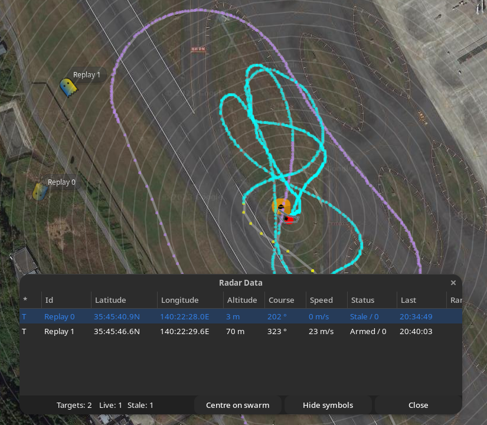
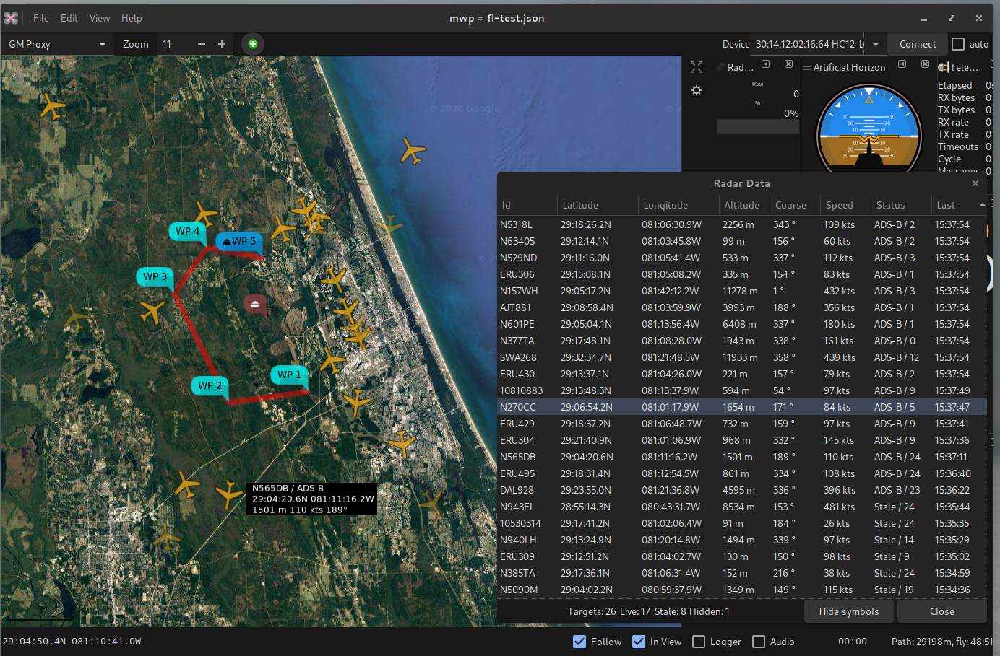
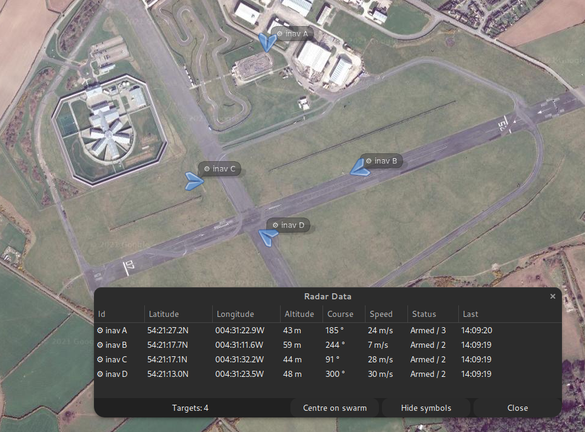

# Radar View

{{ mwp }} supports the display of "radar" contacts. This provides a view of adjacent aircraft obtained from a number of sources:

* [Tracked Telemetry](mwp-telemetry-tracker.md). Models tracked by telemetry (CRSF, LTM, MAVLink, Smartport, MPM(Flysky, Smaprtport)). Provided by RX Telemetry Mirroring or dedicated telemetry radios.
* [INAV-radar](https://www.rcgroups.com/forums/showthread.php?3304673-iNav-Radar-ESP32-LoRa-modems). INAV radar works in conjunction with [INAV](https://github.com/iNavFlight/inav) flight controllers to broadcast the location of UAS fitted with an ESP32 LoRa module. {{ mwp }} can listen to one of these modems in ground station mode to display the positions of the rest of the 'swarm' (up to 4 UAS); [technical / MSP details](#inav-radar).

* **Full size aircraft** reported by the MAVLink 'Traffic Report' / 'ADSB Vehicle' message. Examples of available hardware include:
    * [uAvionix PingRX](https://uavionix.com/products/pingrx/), a compact device that receives ADS-B location data from full sized aircraft and publishes the locations as MAVLink. For a ground based installation, this device has around a 40Km detection radius. [MAVLink ICD](https://uavionix.com/downloads/integration/uAvionix%20Ping%20Integration%20Guide.pdf).
	* [Aerobits TT-SC1](https://www.aerobits.pl/product/aero/). Untested, but supports the same MAVLink API as the PingRX. [Product documentation](https://www.aerobits.pl/wp-content/uploads/ci_uploads_software/tt_sc1/technical_documentation_sc/OEM_SC_Datasheet_07o-v1.1.8.pdf).

* **Full size aircraft** typically reported using SDR (Software Defined Radios) using [SBS streaming TCP protocol](http://woodair.net/sbs/article/barebones42_socket_data.htm). This is generated by the open source [dump1090](https://github.com/flightaware/dump1090) and [readsb](https://github.com/Mictronics/readsb-protobuf) open source applications with a SDR receiver, as well as commercial products.

* **Full size aircraft** typically reported using SDR (Software Defined Radios) using the [dump1090-fa](https://github.com/flightaware/dump1090) JSON format.

* **Full size aircraft** typically reported using SDR (Software Defined Radios) using the [readsb](https://github.com/Mictronics/readsb-protobuf) "protobuf" format. This is the preferred way to access SDR ADSB / Mode-S data.

* **Full size aircraft** reported using the `MSP2_ADSB_VEHICLE_LIST` message. This is generated by [INAV](https://github.com/iNavFlight/inav) later than 7.1.0 when a PingRX or TT-SC1 device is attached to the flight controller. This is received by the main {{ mwp }} MSP port without user configuration (no need to set up a `radar-device`). Due to the size of  `MSP2_ADSB_VEHICLE_LIST` message, {{ mwp }} does not poll for `MSP2_ADSB_VEHICLE_LIST` by default, see the [setting](#settings) key `msp2-adsb`, below.

* Proximity alerts (visual and audible) for manned (ADS-B / sbs-1 / dump1090 / readsb) aircraft, based on planned or actual home location.

For SDR (Software Defined Radios) using the [readsb](https://github.com/Mictronics/readsb-protobuf) or [dump1090](https://github.com/flightaware/dump1090) where the SDR host has a web server configured to supply the generated "protobuf" or JSON output, then {{ mwp }} can obtain the data from the web server. Otherwise, it will be necessary to set up a small daemon on SDR host, see the `src/samples/adsb-extra` directory for further details.

Note that the SDR protocols may also be used with network services that provide ADS-B reports (usually for a fee or for provided local data).

## mwp Configuration

{{ mwp }} can receive the 'radar' data over one or two connections, either or both may be active, and {{ mwp }} can receive and display 'own vehicle' telemetry (MSP, LTM or Smartpost), [Tracked Telemetry](mwp-telemetry-tracker.md), 'INAV-radar' and 'MAVlink Traffic' data simultaneously. Radar data may be received over:

* The main serial port device (see [caveat](#using-the-main-serial-port) for INAV-radar) and `MSP2_ADSB_VEHICLE_LIST`.
* device(s) defined by the `radar-device` CLI or configuration parameter (MAVLink Traffic, INAV-radar, SDR protocols)

The `radar-device` option is defined by the standard {{ mwp }} naming scheme:

* A serial device node, with optional baud rate, e.g.:
    * `/dev/ttyACM0`, `/dev/ttyUSB4@567600`, `/dev/rfcomm3`
    * Serial defaults to 115200 baud, but may be set in the device name (@baudrate)
* A Bluetooth address (for BT bridges)
    * `00:0B:0D:87:13:A2`
* A UDP address, e.g. for simulation, recording replays or serial multiplexer (INAV, mavlink).
    * `udp://:30001` local UDP listener.
* A `readsb` protobuf source or `dump1090` JSON source over `http`/`https`, for example, using hosts `woozle` (protobuf) and `jagular` (JSON):
    * `http://woozle/readsb/data/aircraft.pb`
	* `http://jagular/dump1090/data/aircraft.json`
* A `readsb` protobuf source, defined by a special URI:
    * `pba://[[host][:port]]` (requires `adsbpbsrv` on the SDR host).
  Host and port are optional, defaulting to `localhost` and `38008`. So the minimal "URI" is `jsa://`.
* A `dump1090` JSON source, defined by a special URI:
    * `jsa://[[host][:port]]` (requires `jsacsrv` on the SDR host).
  Host and port are optional, defaulting to `localhost` and `37007`. So the minimal "URI" is `jsa://`.
* A SBS protocol source, defined by a special URI:
    * `sbs://[[host][:port]]`
  Host and port are optional, defaulting to `localhost` and `30003`. So the minimal "URI" is `sbs://`.

For "Telemetry Tracking", please see its [separate article](mwp-telemetry-tracker.md).

The specific (not shared with the main serial port) radar device(s) may be defined on the command line, or in the static command options file (`~/.config/mwp/cmdopts`):

 * `mwp --radar-device udp://:30001`
 * `$ cat ~/.config/mwp/cmdopts`

    	# Default options for mwp
    	# using udev rule to associate a specifc USB-TTL adaptor to a name
		--radar-device=/dev/pingRX@57600

Multiple devices may be defined, e.g.

* As separate options, `--radar-device=/dev/pingRX@57600 --radar-device= /dev/inavradar@115200`
* As a comma separated list: `--radar-device=/dev/pingRX@57600,/dev/inavradar@115200`

Any bespoke `radar-device` is started automatically on startup (or when it shows up). It is not managed via the serial `Connect` button.

## Using the main serial port

The main {{ mwp }} serial port may be used for MavLink Traffic and `MSP2_ADSB_VEHICLE_LIST` messages without any further configuration. For INAV-radar, to use the main MSP port for INAV-radar (vice using `--radar-device`), it is still necessary to add a command option to {{ mwp }}; it needs to told to relax the default inbound MSP direction check.

This is enabled as

    mwp --relaxed-msp

which should be 'mainly harmless' for normal operations. It's entirely acceptable to put this in `~/config/mwp/cmdopts` to make it the default, as the protocol check dilution is slight.

## Settings

The following `dconf` setting affect the radar function:

| Setting | Usage |
| ------- | ----- |
| `radar-list-max-altitude` | Maximum altitude (metres) to show targets in the radar list view; targets higher than this value will show only in the map view. Setting to 0 disables. Note that ADS-B altitudes are AMSL (or geoid) and SDR altitudes are "Flight Level" (standard atmosphere). |
| `radar-alert-altitude` | Target altitude (metres) below which ADS-B / SDR proximity alerts may be generated. Requires that 'radar-alert-range' is also set (none zero). Setting to 0 disables. Note that the above altitude datum. |
| `radar-alert-range` | Target range (metres) below which ADS-B / SDR proximity alerts may be generated. Requires that 'radar-alert-altitude' is also set (none zero). Setting to 0 disables. |
| `ga-alt` | Units for GA Altiude, enumerated as 0=m, 1=ft, 2=FL |
| `ga-range` | Units for GA Range, enumerated as 0=m, 1=km, 2=miles, 3=nautical miles |
| `ga-speed` | Units for GA Speed, enumerated as  0=m/s, 1=kph, 2=mph, 3=knots |
| `msp2-adsb` | Options for requesting MSP2_ADSB_VEHICLE_LIST. "off": never request, "on:" always request, "auto:" heuristic based on serial settings / bandwidth |

Note that proximity alerts require that both the `radar-alert-altitude` and `radar-alert-range` values are set, and that there is a planned or actual home location. For [readsb](https://github.com/Mictronics/readsb-protobuf) "protobuf" data, the range from the **SDR** is available and this will be shown as range (and used for alerts) where there is no home set (home will override).

## Usage

!!! note "Legacy Images"
    The images this section are from legacy mwp, however the capability is the same.

Once the radar interface is open, radar tracks are displayed on the map and in a list available from the "View -> Radar View' menu option.

* The list view is sort-able on the `Id`, `Status`, `Last` (time) and `Range` columns.
* The map visualisation may be toggled by the `Hide Tracks` (`Show Tracks`) button.
* List and map views are updated in (near) real time.
* Preference for display units are used for positions, altitude and speed.

### Name

| Type | Usage |
| ---- | ----- |
| INAV-radar | Node Id (typically 'A' - 'D') |
| Traffic Report | Callsign if reported, otherwise [ICAO number] |
| SDR | Callsign if reported, otherwise [Mode S hexadecimal code] |
| Telemetry | User defined for automatically allocated, prefixed by `TTRK-` |

### Status

Radar contacts have one of the following status values:

| Status | Explanation |
| ------ | ----------- |
| Undefined | ADS-B: Not shown in list or on the map, INAV-Radar not armed / updated |
| Stale | The last contact was more that 120s previous. Displayed in the list and shown on the map with reduced intensity or an INAV-radar node has 'lost' status |
| Armed | An active INAV-radar contact |
| ADS-B | A live MAVLink Traffic report |
| SDR | SDR radio report (sbs, json, protobuf) |
| Hidden | A MAVLink Traffic /SDR contact is between 5 and 10 minutes old. It remains in the list but is not displayed in the map. MAVLink Traffic Report / SDR tracks are removed from the list (and internal storage) after 10 minutes inactivity. INAV-radar ground station. Stale / 'Lost' INAV-radar contacts do not expire, as they may relate to a lost model. |

The number displayed after the status text is:

| Type | Usage |
| ---- | ----- |
| INAV-radar | The link quality |
| Traffic Report | Time since last communication in seconds |
| SDR reports | Time since last communication in seconds |

### Columns

The columns are sortable. Note that since the introduction of [Telemetry Tracking](mwp-telemetry-tracker.md), a new column "*" has been added, this contains a single character indicating the source:

| Indicator | Source |
| --------- | ------ |
| A         | ADS-B via MAVLink |
| I         | INAV Radar |
| S         | ADS-B via SDR protocol |
| T         | Telemetry Tracker |

{: width="70%" }

## Examples

* Proximity Alerts
* Live and stale aircraft
* Aircraft tooltip
* Mission Plan
* List view

### Live ADS-B and simulated INAV targets, with proximity alerts (range < 3000m).

{: width="80%" }

### Local manned aircraft view over Florida (May 2020).

{: width="80%" }

### Simulated INAV radar view

{: width="60%" }

## Simulators

There are simulators for both INAV-radar and MAVLink 'Traffic Report' (e.g. uAvionix PingRX) in the `mwptools/src/samples/radar` directory.

There is a replay tool for SBS CSV logs `mwptools/src/samples/sbs-test/sbs-player.rb`.

## Changing the Radar Symbols

Any map symbol used by {{ mwp }} can be changed by the user; in the image above, the INAV radar node symbol has been changed from the default stylised INAV multirotor to a smaller version of the mission replay "paper plane" symbol as described in [creating your own icon](mwp-Configuration.md#settings-precedence-and-user-updates).

## Protocol documentation

###  MAVLink 'Traffic Report' (e.g. uAvionix PingRX)

The MAVLink implementation is [comprehensively documented](https://uavionix.com/downloads/integration/uAvionix%20Ping%20Integration%20Guide.pdf) by the vendor.

### INAV radar

The following is required by a device wishing to act as a ground node (it either masquerades as an INAV FC, or declares itself a GCS)

* Receive and respond to the following MSP data requests:
    * MSP_FC_VARIANT (responding as `INAV` or (from 2021/05/06) `GCS` for generic ground control stations).
    * MSP_FC_VERSION (in `INAV` and `GCS` modes)
    * MSP_NAME (in `INAV` and `GCS` modes)
    * MSP_STATUS (in `INAV` mode)
    * MSP_ANALOG (in `INAV` mode)
    * MSP_BOXIDS (in `INAV` mode)
    * MSP_RAW_GPS (in `INAV` mode)
* Receive unsolicited
    * MSP2_COMMON_SET_RADAR_POS

Note that the device firmware assumes that MSP buffer sizes are "as specification"; exceeding the expected message buffer size may crash the device (mea culpa).

In `GCS` mode, the node is passive; it does not use a LoRa slot and does not attempt to broadcast a location. In `INAV` mode, the node takes up a LoRa slot and is expected to reply to the additional MSP queries.

{{ mwp }}'s behaviour is defined by the [GCS Location](gcs-features.md#gcs-location-icon)

* If the [GCS Location](gcs-features.md#gcs-location-icon) is defined (when the radar device is initialised, then {{ mwp }} will respond as `INAV` and return the [GCS Location](gcs-features.md#gcs-location-icon), which may be driven by gpsd if required.
* Otherwise, mwp will respond as a passive `GCS`.

### SBS CSV protocol

[Protocol description](http://woodair.net/sbs/article/barebones42_socket_data.htm).
